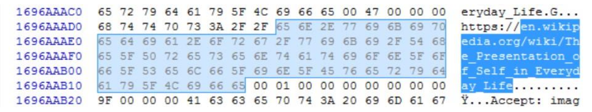
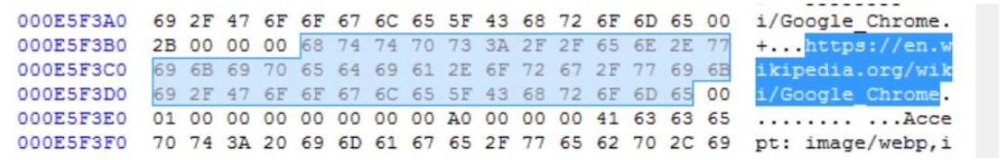
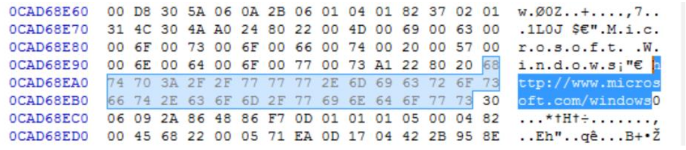

# Private Browsing RAM
We examine private browsing artifacts in RAM dumps. Is it really private?



## Overview
In this toy study, we examine whether it is possible to recover the URLs of websites visited with various browsers, using Private Browsing mode (also called Ingognito).

We examine two separate cases:
- **Browser Exit**: Browse in private mode, terminate the browser app, then dump the memory. Then look for the URLs visited in the memory dump.
- **Computer Shutdown**: Browse in private mode, shut down the computer for 1 minute, restart it, and dump the memory. Then, look for the URLs visited in the memory dump.

## Specifications
The study was conducted in 2016, on using the following browsers:
- **Google Chrome**, version 45.0.2454.101
- **Mozilla Firefox**, version 41.0.1
- **Tor**, version 6.0.6

## Experiment Code
An example code is provided which can be run with
```
sudo bash code/run_experiment.sh
```
Which will use the file `code/url-list` containing test URLs used when browsing in private mode,
to automatically browse each page for 5 seconds (`code/browsing_comp.sh`), exit the browser, and dump the memory (`dumping.sh`).
Then the dump is automatically read (`code/analysis.sh`)and queried for the URLs.

## Results
### Browser Exit Scenario
We find that **all** the URLs browsed in private with both Google Chrome and Mozilla Firefox can be found in the subsequent memory dump.
However, Tor left no traceable URL in memory.







### Computer Shutdown Scenario
Again, Tor leaves no traceable URL in memory, as well as Mozilla Firefox in this case.
However, we do find **some** of the URLs visited with Google Chrome's Incognito browsing, even after shutting down the computer for one minute. Interestingly, this is a case only for long URLs of 70+ characters.


**Note**:
Repeating the tests in 2019 shows that the above Google Chrome privacy issue has been resolved.
